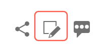

# Guide du contributeur pour la documentation Adobe

Ce guide explique comment contribuer à l’aide d’Adobe Enterprise sur Experience League.

## Qu’est-ce que la documentation collaborative ?

La documentation technique et le contenu d’activation pour Adobe Experience Cloud et d’autres produits Adobe Enterprise reposent sur des principes open source qui utilisent les solutions GitHub, Markdown et Adobe Experience Cloud.

Ce modèle open source améliore la qualité du contenu et la communication entre la clientèle, les équipes de documentation et les équipes produit. Sur chaque page, vous pouvez désormais évaluer l’utilité du contenu, les problèmes de journalisation, et même contribuer à des suggestions de contenu sous la forme de requêtes de tirage Git (PR). Les équipes de documentation Adobe surveillent quotidiennement les contributions et les problèmes et effectuent des mises à jour et des ajustements, le cas échéant.

## Utiliser la documentation collaborative

Lors de l’utilisation de ce contenu, que vous fassiez partie d’une équipe ou de la clientèle, même potentielle, ou que vous soyez partenaire, vous avez le choix de contribuer à cette documentation de plusieurs manières simples.

* Évaluez l’utilité de la page ❶ et écrivez un commentaire facultatif ❷
* Signaler un problème sur une page spécifique (nécessite une connexion Git) ❸
* Envoyer une modification rapide ou des articles entiers, avec des ressources et des exemples de code (nécessite une connexion Git) ❹

Ces options apparaissent au bas de la page quelques secondes après son ouverture. Si vous ignorez la zone de commentaires, vous pouvez recharger la page pour la rétablir.

Ce guide décrit tout ce que vous devez savoir pour interagir avec cet ensemble de contenu et y contribuer.

<!--
>[!IMPORTANT]
>All repositories that publish to docs.adobe.com have adopted the [Adobe Open Source Code of Conduct](../code-of-conduct.md) or the [.NET Foundation Code of Conduct](https://dotnetfoundation.org/code-of-conduct). For more information, see the [Contributing](../contributing.md) article.
>
> Minor corrections or clarifications to documentation and code examples in public repositories are covered by the [Adobe Documentation Terms of Use](https://www.adobe.com/legal/terms.html). New or significant changes generate a comment in the pull request, asking you to submit an online Contribution License Agreement (CLA) if you are not an employee of Adobe. We need you to complete the online form before we can review or accept your pull request.
-->

## Évaluer l’utilité de la page et écrire un commentaire

Quelques secondes après l’ouverture d’une page, une zone de commentaires s’affiche au bas de la page. Cliquez sur le pouce levé ou le pouce baissé pour indiquer si la page s’est avérée utile.

N’hésitez pas à laisser un commentaire pour fournir des retours supplémentaires.

## Apporter des modifications rapides aux documents existants

Si vous souhaitez fournir des retours plus détaillés, apportez des modifications rapides pour corriger les petites erreurs et omissions dans les documents. Lorsque vous suggérez une modification, vous envoyez une requête de tirage pour nous soumettre la correction/suggestion, que nous pouvons ensuite refuser, approuver et publier.

1. Signez le [contrat de licence du contributeur (CLA)](http://opensource.adobe.com/cla.html) si acceptable.

   Il suffit d’envoyer une seule fois un CLA Adobe.

1. Dans la zone de commentaires qui s’affiche au bas de l’article, cliquez sur **[!UICONTROL Detailed feedback options]**, puis sur **[!UICONTROL Suggest an edit]** pour accéder au fichier source Markdown sur GitHub.

   

1. Cliquez sur l’icône représentant un crayon pour modifier l’article.

   >[!NOTE]
   >
   >Si l’icône en forme de crayon est grisée, vous devez vous connecter à votre compte GitHub ou créer un compte.

   

1. Apportez vos modifications dans l’éditeur Web.

   Vous pouvez cliquer sur l’onglet **[!UICONTROL Preview changes]** pour vérifier la mise en forme de votre modification.

1. Une fois les modifications effectuées, faites défiler vers le bas de la page.

   Saisissez un titre et une description pour votre requête de tirage, puis cliquez sur **[!UICONTROL Propose file change]**, comme le montre l’image suivante :

   

   >[!NOTE]
   >
   >Si vous recevez un message d’erreur de validation sur la signature d’un contrat de licence du contributeur ou de la contributrice (CLA), cliquez sur **[!UICONTROL Details]** pour ouvrir le contrat de licence. Signez l’accord, si acceptable. Fermez et ouvrez ensuite la demande de tirage, puis continuez.

C’est aussi simple que cela. Les membres de l’équipe de documentation examineront et fusionneront votre requête de tirage. Merci !

## Signaler un problème

Une autre manière simple de nous informer d’un problème lié à un élément de contenu consiste à utiliser **[!UICONTROL Report an issue]**.

1. Dans la zone de commentaire qui s’affiche au bas de l’article, cliquez sur **[!UICONTROL Detailed feedback options]**, puis sur **[!UICONTROL Report an issue]** pour accéder au fichier source Markdown sur GitHub.

   

   >[!NOTE]
   >
   >Pour signaler un problème, vous devez vous connecter à votre compte GitHub ou créer un compte.

   En cliquant sur ce lien, vous pouvez consigner un ticket rapide avec Experience League, à l’aide de l’interface GitHub Issues.

   L’URL de la page contenant le problème s’affiche automatiquement dans le champ de description.

1. Renseignez le titre, rédigez une brève description du problème, puis cliquez sur *Envoyer le nouveau problème*.

   

L’envoi d’un problème avertit l’équipe de contenu de cette page, qui peut résoudre votre problème. Une fois le contenu mis à jour, nous vous informerons dans l’interface GitHub Issues. Ensuite, vous serez averti par courrier électronique une fois la mise à jour ou la fermeture effectuée.

## Comprendre les autorisations GitHub

L’interface utilisateur de modification de GitHub s’adapte aux autorisations de votre référentiel. Les images précédentes sont exactes pour les contributeurs qui ne disposent pas d’autorisations d’écriture dans le référentiel cible. GitHub crée automatiquement un double du référentiel cible dans votre compte. Si vous disposez d’un accès en écriture au référentiel cible, GitHub crée une branche dans le référentiel cible.

Adobe utilise des requêtes de tirage pour toutes les modifications, même dans le cas de contributeurs disposant d’un accès en écriture. La plupart des référentiels disposent d’une protection pour la branche `main`, de sorte que les mises à jour doivent être soumises en tant que requêtes de tirage.

L’expérience d’édition intégrée au navigateur est préférable pour les modifications mineures ou occasionnelles. Si vous effectuez des contributions de grande ampleur ou utilisez des fonctionnalités Git avancées, nous vous recommandons de [dupliquer le référentiel et de travailler localement](setup/full-workflow.md).

## Fournir des commentaires

Avec une solution aussi vaste que celle d’Adobe, la documentation est toujours une œuvre inachevée. Si vous détectez des erreurs, consignez un problème, si vous avez des suggestions sur le matériel, partagez-les avec nous. Indiquez les informations que vous recherchez. Dites-nous si vous ne trouvez pas ce dont vous avez besoin ou, si vous avez rencontré des difficultés pour mener à bien votre tâche, faites-nous savoir comment nous pouvons vous aider à assimiler nos solutions.

L’équipe en charge de la documentation collaborative et tous les auteurs, autrices, producteurs et productrices de contenu d’Experience League vous adressent leurs remerciements.
