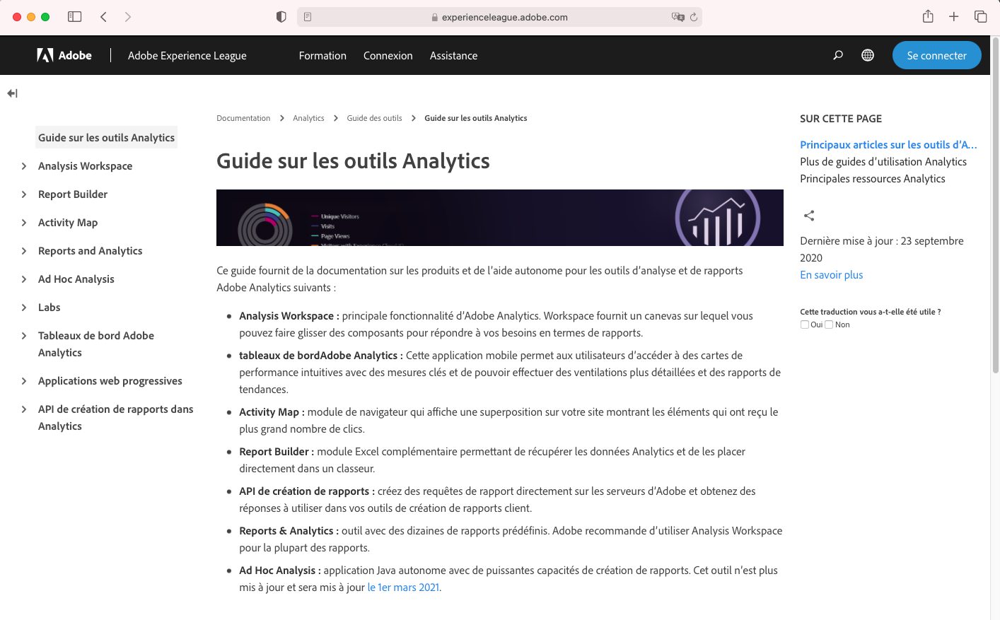
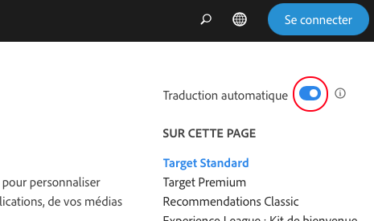

# Prise en charge linguistique de la documentation Adobe Experience Cloud

Nous sommes conscients que vous comptez sur le fait que la documentation, l’aide et le contenu de support des produits soient rapidement disponibles dans les langues prises en charge par les produits Adobe. Pour y parvenir, nous vous offrons une expérience de traduction unique qui vous permet de sélectionner la langue de votre choix et de donner votre avis sur la qualité du contenu traduit.

## Sélection d’une langue

Vous pouvez consulter la documentation Adobe Experience Cloud dans de nombreuses langues.

1. Accédez à la [documentation](https://helpx.adobe.com/fr/support/experience-cloud.html) Experience Cloud.

1. Recherchez une page d’aide (par exemple celle d’[Analytics](https://docs.adobe.com/content/help/fr-FR/analytics/landing/home.html)).

1. Cliquez sur le sélecteur (icône du globe), puis sélectionnez une langue.

   

   La page s’affiche dans la langue que vous avez sélectionnée.

   

   Si la version dans votre langue n’est pas encore disponible, Adobe peut traduire automatiquement le contenu. Le service de traduction automatique d’Adobe affiche un message en haut de la barre de navigation de droite :

   

   Le contenu peut être traduit automatiquement dans votre langue ou vous pouvez cliquer sur un lien pour activer la traduction. (C’est parfois le cas lorsque vous avez cliqué sur l’hyperlien pour revenir à la source anglaise de la page traduite. Vous avez ainsi la possibilité de visualiser la page traduite dans votre langue sur demande.) Vous pouvez retourner à la page source en anglais à tout moment.

   Il arrive que le contenu source en anglais ait été mis à jour et publié récemment avant la fin des traductions. Lorsque vous cliquez sur votre langue dans le menu déroulant, une notification s’affichera dans la barre horizontale bleu clair en haut de la page pour vous informer que la page a été automatiquement traduite à partir de la version précédente et que le contenu sera bientôt mis à jour. Si vous préférez, vous aurez la possibilité de consulter le contenu source en anglais le plus récent dans une nouvelle fenêtre de votre navigateur.

## Pourquoi utiliser la traduction automatique ?

Adobe tire parti des capacités de la traduction automatique pour publier le contenu de support dans différentes langues, et ce, le plus rapidement possible après la création du contenu. Étant donné que le contenu de support est essentiel à l’utilisation du produit, nous privilégions la traduction par des professionnels qualifiés, mais nous optons également pour la traduction automatique lorsque les délais sont plus serrés.

La traduction automatique est omniprésente sur Internet et son utilisation est généralement acceptée comme un puissant outil de collecte d’informations. Elle est largement répandue pour les contenus de base de connaissances, pour lesquels l’intervention humaine peut être minime ou nulle. Malgré d’importantes avancées technologiques au cours des dernières années, les traductions générées automatiquement peuvent parfois contenir des inexactitudes et des erreurs de syntaxe et de sens.

### Traduction automatique via le navigateur

Si vous avez paramétré les préférences de votre navigateur pour traduire automatiquement n’importe quelle page dans votre langue, sachez que les traductions obtenues seront différentes de celles obtenues via la page Adobe. En effet, le service offert par le navigateur peut être de la traduction de base, alors que les traductions fournies par Adobe auront été personnalisées pour respecter la terminologie et le style d’Adobe. Pour obtenir des résultats de traduction automatique optimaux, nous vous recommandons de désactiver l’option du navigateur pour ce site spécifique dans les préférences de votre navigateur ou de cliquer sur **Ne jamais traduire** lorsque l’option s’affiche.

### Problèmes connus

Il se peut que vous rencontriez occasionnellement des problèmes avec le résultat de la traduction automatique, tels que des traductions incomplètes, des caractères corrompus ou des problèmes de mise en page. Ils sont causés par l’un des nombreux outils de création, de publication ou de traduction utilisés par Adobe. Nous ferons tout notre possible pour répertorier ci-dessous les problèmes connus.

| **ID DU PROBLÈME** | **DESCRIPTION** | **STATUT** |
|--------------|-------------------------------------------------------------------------------------|------------|
| G11N3558 | Certaines pages d’Audience Manager sont à moitié en anglais et à moitié traduites (en français et en espagnol). | OUVRIR |

### Commentaires

Chaque fois que du contenu est traduit automatiquement, que ce soit par défaut ou à la demande de l’utilisateur, il est possible de faire parvenir à Adobe des commentaires sur les traductions. Dans la barre horizontale bleu clair en haut de la page, vous pouvez répondre « Oui » ou « Non » à la question « Cette traduction a-t-elle été utile ? ». Adobe recueille ces précieuses mesures, les compile, puis les analyse afin de prendre des décisions concernant la traduction du contenu. Nous apprécions vos commentaires et nous vous encourageons à répondre à cette question.

À l’avenir, nous prévoyons de vous permettre de fournir des commentaires plus complets, en signalant un problème, en proposant des améliorations et même en demandant des langues supplémentaires. Certaines de ces fonctionnalités sont déjà disponibles sur les pages en anglais. Sur le long terme, nous pensons que cela nous aidera à améliorer l’expérience utilisateur sur ces pages.

<!--

-->

### Avertissement de traduction

Adobe utilise un programme de traduction automatique pour rendre du texte disponible dans différentes langues. Veuillez noter que les traductions informatisées sont des traductions littérales et peuvent contenir des erreurs. Adobe ne garantit ni la précision, ni la fiabilité des traductions fournies, et celles-ci peuvent prendre du temps avant d’être disponibles. Adobe n’est en aucun cas responsable des pertes ou dommages causés par le manque de fiabilité ou d’exactitude des informations traduites. S’il existe des différences entre l’anglais et une autre langue, la version anglaise fait foi.

Si vous souhaitez signaler une erreur de traduction ou une inexactitude, nous vous invitons à nous contacter.
