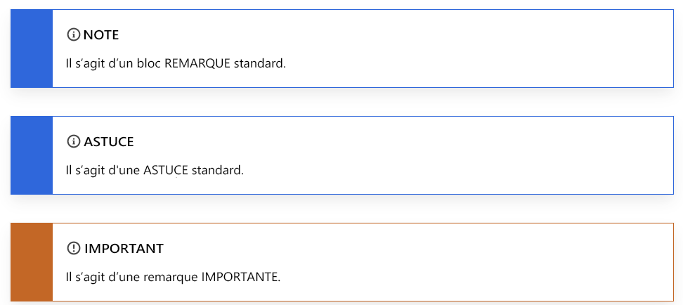

# Utilisation de Markdown pour la rédaction de documentation technique

Les articles de documentation technique d’Adobe sont rédigés dans un langage de marquage léger appelé [Markdown](https://daringfireball.net/projects/markdown/), qui est à la fois facile à lire et à apprendre.

À mesure que nous stockons le contenu de documents Adobe dans GitHub, il peut utiliser une version de Markdown appelée [GitHub Flavored Markdown (GFM)](https://help.github.com/categories/writing-on-github/), qui offre des fonctionnalités supplémentaires pour les besoins de formatage courants. De plus, Adobe a élargi le champ d’application de Markdown afin de prendre en charge certaines fonctionnalités d’aide, telles que les notes, les conseils et les vidéos intégrées.

## Concepts de base de Markdown

Les sections suivantes décrivent les principes de base de la création en Markdown.

### Titres

Pour créer un titre, utilisez un signe dièse (#) en début de ligne :

```
# This is level 1 (article title)
## This is level 2
### This is level 3
#### This is level 4
##### This is level 5
```

### Texte de base

Un paragraphe ne nécessite pas de syntaxe spéciale dans Markdown.

Pour mettre le texte en **gras**, entourez-le de deux astérisques. Pour mettre le texte en *italique*, entourez-le d’astérisques uniques :

```markdown
   This text is **bold**.
   This text is *italic*.
   This text is both ***bold and italic***.
```

Pour ignorer les caractères de formatage Markdown, utilisez \ avant le caractère :

```markdown
This is not \*italicized\* type.
```

### Listes numérotées et listes à puces

Pour créer des listes numérotées, commencez une ligne par `1.` ou `1)`, mais n’utilisez pas les deux formats dans la même liste. Il n’est pas nécessaire de spécifier les nombres. GitHub le fait pour vous.

```markdown
1. This is step 1.
1. This is the next step.
1. This is yet another step, the third.
```

Contenu affiché :

1. This is step 1.
1. This is the next step.
1. This is yet another step, the third.

Pour créer des listes à puces, commencez une ligne par \* ou - ou +, mais ne mélangez pas les formats dans la même liste. (Ne mélangez pas les formats de puces, tels que \* et \+, dans le même document.)

```markdown
* First item in an unordered list.
* Another item.
* Here we go again.
```

Contenu affiché :

* First item in an unordered list.
* Another item.
* Et un de plus.

Vous pouvez également intégrer des listes dans d’autres listes et ajouter du contenu entre les éléments de la liste.

```markdown
1. Set up your table and code blocks.
1. Perform this step.

   

1. Make sure that your table looks like this: 

   | Hello | World |
   |---|---|
   | How | are you? |  

1. This is the fourth step.

   >[!NOTE]
   >
   >This is note text.

1. Do another step.
```

Contenu affiché :

1. Set up your table and code blocks.
1. Perform this step.

   

1. Make sure that your table looks like this:

   | Hello | World |
   |---|---|
   | How | are you? |

1. This is the fourth step.

   >[!NOTE]
   >
   >Ceci est le texte de la note.

1. Do another step.

### Tableaux

Les tableaux ne font pas partie de la spécification Markdown de base, mais Adobe les prend en charge dans une certaine mesure. Markdown ne prend pas en charge les listes à lignes multiples dans les cellules. Il est recommandé d’éviter d’utiliser plusieurs lignes dans les tableaux. Vous pouvez créer des tableaux à l’aide de la barre verticale (|) pour délimiter les colonnes et les lignes. Les traits d’union créent l’en-tête de chaque colonne, tandis que les barres verticales séparent chaque colonne. Insérez une ligne vierge avant votre tableau afin qu’il soit rendu correctement.

```markdown
| Header | Another header | Yet another header |
|--- |--- |--- |
| row 1 | column 2 | column 3 |
| row 2 | row 2 column 2 | row 2 column 3 |
```

Contenu affiché :

| Header | Another header | Yet another header |
|--- |--- |--- |
| row 1 | column 2 | column 3 |
| row 2 | row 2 column 2 | row 2 column 3 |

Les tableaux simples fonctionnent correctement dans Markdown. Toutefois, les tableaux contenant plusieurs paragraphes ou listes dans une cellule sont difficiles à utiliser. Pour ce type de contenu, nous recommandons d’utiliser un autre format, comme des titres et du texte.

Pour plus d’informations sur la création de tableaux, voir :

* [Organisation des informations de GitHub avec des tableaux](https://docs.github.com/fr/github/writing-on-github/organizing-information-with-tables)
* L’application Web [Markdown Tables Generator](https://www.tablesgenerator.com/markdown_tables)
* [Convertir les tableaux HTML en Markdown](https://jmalarcon.github.io/markdowntables/)

### Liens

La syntaxe Markdown d’un lien inséré se compose de la partie `[link text]`, qui est le texte qui sera affiché sous forme d’hyperlien, suivie de la partie `(file-name.md)`, qui est l’URL ou le nom de fichier lié à :

`[link text](file-name.md)`

```markdown
[Adobe](https://www.adobe.com)
```

Contenu affiché :

[Adobe](https://www.adobe.com)

Pour les liens vers des articles (références croisées) dans le référentiel, utilisez des liens relatifs. Vous pouvez utiliser tous les opérandes de liens relatifs, tels que ./ (répertoire actuel), ../ (retour d’un répertoire) et ../../ (retour de deux répertoires).

```markdown
See [Overview example article](../../overview.md)
```

Pour plus d’informations sur les liens, consultez l’article [Liens](linking.md) de ce guide pour en savoir plus sur la syntaxe.

### Images

```markdown

```

Contenu affiché :


### Blocs de code

Markdown prend en charge le placement de blocs inséré dans une phrase et en tant que bloc « clôturé » séparé entre des phrases. Pour plus d’informations, reportez-vous [à l’assistance native de Markdown pour les blocs de code.](https://daringfireball.net/projects/markdown/syntax#precode)

Utilisez des accents graves (`` ` ``) pour créer des styles de code intraligne au sein d’un paragraphe. Pour créer un bloc de code multi-lignes spécifique, ajoutez trois accents graves (` ``` `) avant et après le bloc de code (appelé « bloc de code clôturés » en Markdown et un composant de « bloc de code » dans AEM). Pour les blocs de code clôturés, ajoutez la langue de code après le premier jeu d’accents graves afin que Markdown mette correctement en évidence la syntaxe du code. Exemple : ` ```javascript`

Exemples :

```markdown
This is `inline code` within a paragraph of text.
```

Contenu affiché :

This is `inline code` within a paragraph of text.

Il s’agit d’un bloc de code clôturé :

```javascript
function test() {
 console.log("notice the blank line before this function?");
```

## Extensions Markdown personnalisées

Les articles Adobe utilisent Markdown standard pour la plupart des mises en forme d’articles, tels que les paragraphes, les liens, les listes et les en-têtes. Pour une mise en forme plus riche, les articles peuvent utiliser des fonctions Markdown étendues telles que :

* Blocs de notes
* Vidéos intégrées
* Balises de traduction
* Propriétés des composants, telles que l’attribution d’un ID d’en-tête différent à un en-tête et la spécification d’une taille d’image

Utilisez le guillemet anglais Markdown (>) au début de chaque ligne pour associer un composant étendu, comme une note.

Certains éléments de Markdown courants, tels que les en-têtes et les blocs de code, incluent des propriétés étendues. Si vous devez modifier les propriétés par défaut, ajoutez les paramètres entre crochets français /{ /} après le composant. Les propriétés étendues sont décrites en contexte.

### Blocs de notes

Vous pouvez choisir parmi ces types de blocs-notes afin d’attirer l’attention sur un contenu spécifique :

* `[!NOTE]`
* `[!TIP]`
* `[!IMPORTANT]`
* `[!CAUTION]`
* `[!WARNING]`
* `[!ADMINISTRATION]`
* `[!AVAILABILITY]`
* `[!PREREQUISITES]`
* `[!ERROR]`
* `[!ADMINISTRATION]`
* `[!INFO]`
* `[!SUCCESS]`

En général, les blocs de notes doivent être utilisés avec parcimonie, car ils peuvent être perturbateurs. Bien qu’ils prennent également en charge les blocs de code, les images, les listes et les liens, faites en sorte que les blocs de notes restent simples et directs.


```markdown
>[!NOTE]
>
>This is a standard NOTE block.
```

```markdown
>[!TIP]
>
>This is a standard TIP.
```

```markdown
>[!IMPORTANT]
>
>This is an IMPORTANT note.
```

Contenu affiché :



### Vidéos

Les vidéos intégrées ne sont pas rendues nativement dans Markdown, mais vous pouvez utiliser cette extension Markdown.

```markdown
>[!VIDEO](https://video.tv.adobe.com/v/29770/?quality=12)
```

Contenu affiché :

>[!VIDEO](https://video.tv.adobe.com/v/29770/?quality=12)

### More Like This

Le composant « More Like This » dans AEM s’affiche à la fin d’un article. Il affiche les liens connexes. Lorsque l’article est rendu, il peut être formaté comme les en-têtes de niveau 2 (# #) sans être ajouté à la mini-table des matières.


Contenu affiché :

>[!MORELIKETHIS]
>
* [Article 1](https://helpx.adobe.com/fr/support/analytics.html)
* [Article 2](https://helpx.adobe.com/fr/support/audience-manager.html)

### UICONTROL et DNL

Tout notre contenu dʼaide Markdown est initialement localisé à lʼaide de la traduction automatique. Si lʼaide nʼa jamais été localisée, nous conservons la traduction automatique. Cependant, si le contenu dʼaide a été localisé dans le passé, le contenu traduit par lʼordinateur agit comme espace réservé pendant que le contenu est en cours de traduction humaine.

**``**

Lors de la traduction automatique, les éléments balisés avec `` sont comparés à une base de données de localisation pour la traduction appropriée. Dans le cas où lʼinterface utilisateur nʼest pas localisée, cette balise permet au système de laisser la référence de lʼinterface utilisateur en anglais pour cette langue spécifique (c.-à-d. les références Analytics en italien).

**Exemple :**

1. Accédez au **Exécuter le processus** écran.
1. Choisir **Fichier** > **Imprimer** > **Imprimer tout** pour imprimer tous les fichiers de votre serveur.
1. La boîte de dialogue Règles de traitement s’affiche.

**Source :**

```markdown
1. Go to the **[!UICONTROL Run Process]** screen.
1. Choose **[!UICONTROL File] > [!UICONTROL Print] > [!UICONTROL Print All]** to print all the files on your server.
1. The [!UICONTROL Processing Rules] dialog box appears.
```

>[!NOTE]
>
Parmi les trois options de balisage, il sʼagit de la plus importante pour fournir une qualité élevée. Elle est obligatoire.

**`[!DNL]`**

En règle générale, nous utilisons une liste « Ne pas traduire » pour signifier aux moteurs de traduction ce quʼil faut garder en anglais. Les éléments les plus courants sont les noms de solutions longs comme « Adobe Analytics », « Adobe Campaign » et « Adobe Target ». Cependant, dans certains cas, il peut être nécessaire de forcer le moteur à utiliser lʼanglais parce que le terme en question peut être utilisé dʼune manière spécifique ou générale. Le cas le plus évident est celui des noms courts de solutions comme « Analytics », « Campaign », « Target », etc. Il est difficile pour une machine de comprendre quʼil sʼagit de noms de solutions et non de termes généraux. La balise peut également être utilisée pour les noms ou fonctionnalités de tiers qui restent toujours en anglais ou pour des sections de texte plus courtes telles quʼune phrase ou un mot qui doivent rester en anglais.

**Exemple :**

* Avec Target, vous pouvez créer des tests A/B afin de trouver la méthode optimale.
* Adobe Analytics est une solution performante pour collecter des données et analyses sur votre site. Analytics peut également vous aider à créer des rapports pour digérer facilement ces données.

**Source :**

```markdown
* With [!DNL Target], you can create A/B tests to find the optimal 
* Adobe Analytics is a powerful solution to collect analytics on your site. [!DNL Analytics] can also help you with reporting to easily digest that data.
```

## Pièges et résolution de problèmes

### Texte alternatif

Le texte alternatif qui contient des tirets bas ne sera pas rendu correctement. Par exemple, au lieu d’utiliser :

```markdown

```

Nous vous conseillons d’utiliser des tirets (-) plutôt que des tirets bas (_) dans les noms de fichier.

```markdown

```

### Apostrophes et guillemets

Si vous copiez du texte dans un éditeur Markdown, il peut contenir des apostrophes ou des guillemets « intelligentes » (courbes). Ils doivent être codés ou remplacés par des apostrophes ou des guillemets de base. Sinon, vous obtenez des caractères bizarres tels que celui-ci lorsque le fichier est publié : It’s.

Voici les encodages des versions « intelligentes » de ces signes de ponctuation :

* Guillemet gauche (ouvrant) : `“`
* Guillemet droit (fermant) : `”`
* Guillemet ou apostrophe simple droit (fermant) : `’`
* Guillemet ou apostrophe simple gauche (ouvrant) (rarement utilisé) : `‘`

### Chevrons

Si vous utilisez des chevrons dans le texte (et non dans le code) de votre fichier (par exemple, pour désigner un caractère générique), vous devez encoder les chevrons manuellement. Sinon, Markdown pense qu’il s’agit d’une balise HTML.

Par exemple, encodez `<script name>` comme `&lt;script name&gt;`

### Esperluettes dans les titres

Les esperluettes (&amp;) ne sont pas autorisées dans les titres. Utilisez plutôt « et » ou l’encodage `&amp;`.

## Voir également

### Ressources Markdown

* [Présentation de Markdown](https://daringfireball.net/projects/markdown/syntax)
* [Concepts de base de GitHub Markdown](https://docs.github.com/fr/github/writing-on-github/getting-started-with-writing-and-formatting-on-github)
